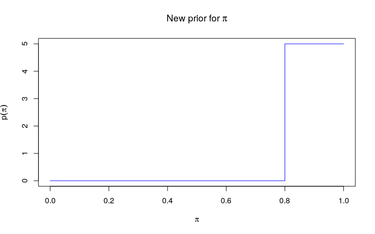

In this vignette, we show how custom functions for priors, likelihood, or
movement of parameters and augmented data can be used in *outbreaker2*. In all
these functions, the process will be similar:

1. write your own function with the right arguments
2. pass this function as an argument to a `custom...` function
3. pass the result to *outbreaker2*

Note that 2-3 can be a single step if passing the function to the arguments of
*outbreaker2* directly. Also note that **all priors and likelihoods are expected
on a log scale**. Finally, also note that while the various `custom...`
functions will try to some extent to check that the provided functions are
valid, such tests are very difficult to implement. In short: you are using these
custom features at your own risks - make sure these functions work before
passing them to *outbreaker2*.


<br>

# Customising priors

Priors of *outbreaker2* must be a function of an `outbreaker_param` list (see
`?outbreaker_param`). Here, we decide to use a step function rather than the
default Beta function as a prior for *pi*, the reporting probability.


We start by defining two functions: an auxiliary function `f` which returns
values on the natural scale, and which we can use for plotting the prior
distribution, and then a function `f_pi` which will be used for the
customisation.


```r
f <- function(pi) {
    ifelse(pi < 0.8, 0, 5)
}

f_pi <- function(param) { 
    log(f(param$pi))
}

plot(f, type = "s", col = "blue", 
     xlab = expression(pi), ylab = expression(p(pi)), 
     main = expression(paste("New prior for ", pi)))
```




While `f` is a useful function to visualise the prior, `f_pi` is the function
which will be passed to `outbreaker`. To do so, we pass it to `custom_priors`:


```r

priors <- custom_priors(pi = f_pi)
priors
#> 
#> 
#>  ///// outbreaker custom priors ///
#> 
#> class: custom_priors list
#> number of items: 4 
#> 
#> /// custom priors set to NULL (default used) //
#> $mu
#> NULL
#> 
#> $eps
#> NULL
#> 
#> $lambda
#> NULL
#> 
#> /// custom priors //
#> $pi
#> function (param) 
#> {
#>     log(f(param$pi))
#> }
```

Note that `custom_priors` does more than just adding the custom function to a
list. For instance, the following customisations are all wrong, and rightfully
rejected:


```r

## wrong: not a function
## should be pi = function(x){0.0}
custom_priors(pi = 0.0)
#> Error in custom_priors(pi = 0): The following priors are not functions: pi

## wrong: two arguments
custom_priors(pi = function(x, y){0.0})
#> Error in custom_priors(pi = function(x, y) {: The following priors dont' have a single argument: pi
```


